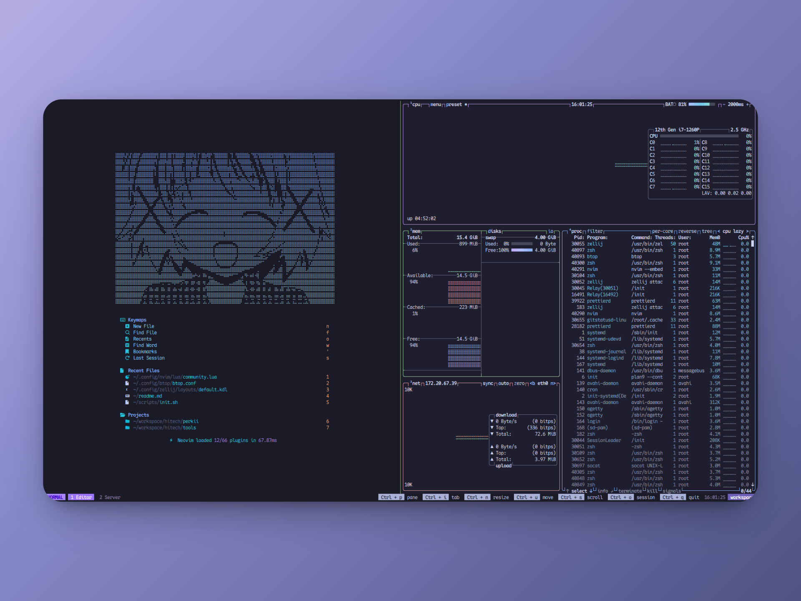

# Nulldev Dotfiles



```bash
# Set up an alias to manage dotfiles as a bare Git repository
alias config='/usr/bin/git --git-dir=$HOME/.dotfiles/ --work-tree=$HOME'

# Clone the dotfiles repository as a bare repo (doesn't create a working directory)
git clone --bare https://github.com/null-d-e-v/dotfiles.git $HOME/.dotfiles

# Prevent Git from showing untracked files (i.e., files not in your dotfiles repo)
config config --local status.showUntrackedFiles no

# Check out the actual dotfiles into $HOME
config checkout

# Initialize and update Git submodules (e.g., plugins, tools)
config submodule init
config submodule update

# Make the initial setup script executable and run it
chmod +x ~/scripts/init.sh
~/scripts/init.sh

# Start a new Zsh session (required for pyenv/nvm and other shell configs to take effect)
echo "Starting a new Zsh session..."
exec zsh

# Make the development setup script executable and run it
chmod +x ~/scripts/development.sh
~/scripts/development.sh
```
